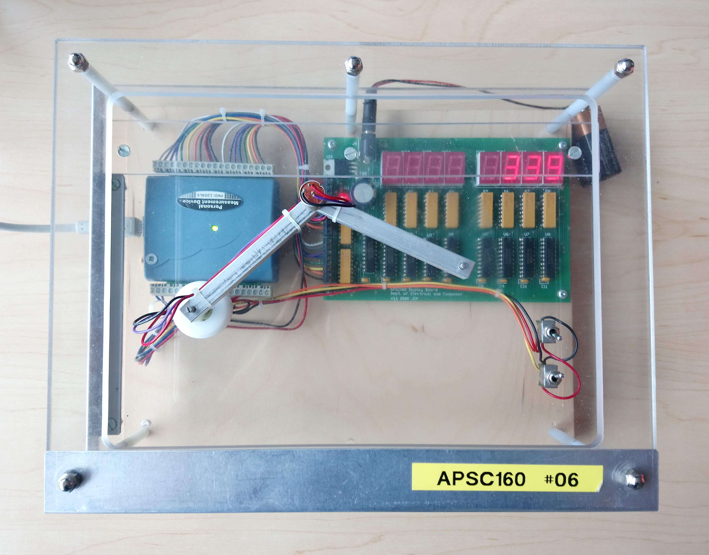

In this challenge, we will create the *DAQ general framework*, which will form the basis for most DAQ-related programs in this course.

The DAQ is a hardware module that reads signals from a set of physical sensors, processes data, and writes to output pins and digital displays.



It will be your job to write the main program that handles device setup, I/O, and data processing.  

Your program first needs to initialize the device with a "setup" number.  The DAQ has a set of pre-configured device layouts consisting of sensors and display components. The setup number informs the system which of these layouts to use for the current program.  Your program should then check whether the device is ready to process inputs/outputs, and continue to loop and process data until the device has been shut-down.

Complete the program details, marked `TODO` in the template below:
- prompt the user to enter a setup number with the expression `"Enter the DAQ setup number: "`
- initialize the device using the supplied setup number and check if setup was successful
  - if successful, call the control loop function
  - otherwise, print the error message `"ERROR: cannot initialize the DAQ\n"`
- in a loop, continuously check whether the device is ready to process inputs/outputs until the device has been shut-down

```c
/* headers */
#include <DAQlib.h>
#include <stdio.h>

/* constants */
#define TRUE  1
#define FALSE 0

/* function prototypes */
void controlLoop(void);

/* main function */
int main(void) 
{
  int setupNum = 0;   /* initial DAQ configuration */

  /* TODO: prompt user for setup number */

  if ( FALSE /* TODO: setup DAQ and check if successful */ ) {
    /* TODO: call the control loop function */
  } else {
    /* TODO: print error statement */
  }

  return 0;
}

/* control loop / work function */
void controlLoop(void) 
{
  while (FALSE /* TODO: check if DAQ available */) {

    /* will do something interesting here later in the course */
    printf("The DAQ is running\n");

  }
  printf("The DAQ is closing\n");
}
```
You are provided two functions:

- `int setupDAQ(int setupNum)`: initializes the device with the given configuration
- `int continueSuperLoop(void)`: checks if the device is ready for processing

Both return either `TRUE` (1) for success, or `FALSE` (0) for failure.

---
## Evaluation

This online task uses a modified text-only simulator.  The text-only simulator differs from the graphical simulator and hardware in that it prints/reads values to/from the command-line.  Specifically:

- When `setupDAQ(...)` is called, the setup number is printed to standard output (`stdout`)
- Each time `continueSuperLoop()` is called, 
  - the current device outputs are printed to standard output (`stdout`)
  - the new sensor values are read from standard input (`stdin`)

If there are no more lines of input, or if the next input line contains an invalid character, then `continueSuperLoop()` will return `FALSE` (0), signalling that your control loop should exit.

## Input Format

The first line of input consists of the setup number.

The rest of the input is handled for you by the `DAQlib` library.  Each line in corresponds to the values of the input sensors at the next `continueSuperLoop()` call.

## Output Format

The first line of output should consist of the prompt `"Enter the DAQ setup number: "`, along with the echoed setup number.

If setup was unsuccessful, the second line should consist of the error message `"ERROR: cannot initialize the DAQ\n"`.

Otherwise, the control loop function should be called, and output will be governed by calls to `continueSuperLoop()`, and the provided `printf(...)` statements.  Whenever `continueSuperLoop()` is called, a collection of 1 to 5 lines will be printed, depending on the output devices attached to the DAQ.  Digital/analog outputs will be printed first on a single line (if available).  If the device contains a seven-segment display, then an additional four lines are printed to show the values of the displays.

---

## Sample 1

### Input
```default
2
0 0
```

### Output

```default
Enter the DAQ setup number: 2
 0 0 0
The DAQ is running
 0 0 0
The DAQ is closing
```

### Explanation

The DAQ with configuration 2 contains two digital input switches and three digital output LEDs.  

At the beginning of the first super-loop, when `continueSuperLoop()` is called for the first time, all three output LEDs are initially off (`0`).  Since there is one line of valid inputs, `continueSuperLoop()` will read in the values of the switches and return `TRUE`, causing the super-loop to execute and print the line `"The DAQ is running`.  The second time `continueSuperLoop()` is called, it prints the current values for the output LEDs (which are still off, since we never turned them on).  Since there are no more valid lines of input, `continueSuperLoop()` returns `FALSE` and the loop exists, printing `"The DAQ is closing"`.

---

## Sample 0

### Input
```default
0
0 0 0.00 0.00
```

### Output

```default
Enter the setup number: 0

                                 
                                 
 ___ ___ ___ ___ ___ ___ ___ ___ 
 The DAQ is running
                                 
                                 
                                 
 ___ ___ ___ ___ ___ ___ ___ ___ 
 The DAQ is closing

```

### Explanation

The first line of input contains the setup number for the hardware module, `0`.  The hardware has two digital input switches and two analog potentiometer inputs.  The second line of input sets the values of these sensors.  The two switches are initially `OFF` (0), and the two analog inputs read `0.00` volts.  We will discuss inputs/outputs in more detail later in the course.

The expected output first displays the prompt and setup number.  The hardware device has no digital or analog output devices, but does have 8 seven-segment display units.  Without writing to the seven-segment displays, they should print blank characters `___`.  

The first set of four lines indicate that the displays are all off when the program starts and `continueSuperLoop()` is called for the first time.  Since there is one line of valid inputs, the control loop should execute once successfully, printing `"The DAQ is running"`.  The second set of four lines corresponds to display values after that first iteration, when `continueSuperLoop()` is called for a second time.  Since there are no more valid lines of input, this function will return `FALSE` and the loop should exit, printing `"The DAQ is closing"`.

---
## Sample 3

### Input
```default
99
```

### Output

```default
Enter the DAQ setup number: 99
ERROR: cannot initialize the DAQ
```

### Explanation

There is no valid configuration for setup number 99, so initialization fails and the error message is printed.

---

### Testing

You should be able to run and test your program at home or in the lab with the regular simulator.

To try with the text-based simulator,
