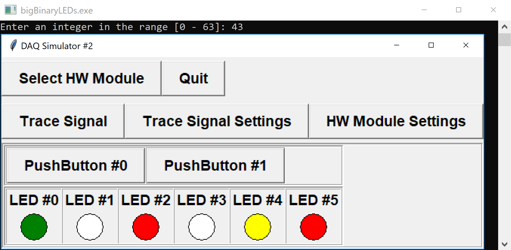

The DAQ module with configuration `2` has two digital inputs (push-buttons) and six digital outputs (LEDs).  We will ignore the two push-buttons, and instead read data from standard input (`stdin`) using `scanf(...)`.  The LEDs are on consecutive digital output channels 0 - 5.

We are going to write a program that will display the binary representation of integers using the LEDs.  Your program should continuously do the following:
- prompt the user to `"Enter an integer in the range [0 - 63]: "`
- read the entered integer value from standard input
- display the binary representation using the LEDs, with `ON = 1` and `OFF = 0`

The left-most LED, `LED0`, represents the *most-significant bit*, and the right-most LED, `LED5` the *least-significant bit*.  If the supplied integer is not in the range [0 - 63], turn all LEDs off and print the message `"Invalid integer\n"` to standard output.

For example, if the number 43 is entered by the user, it is written as `101011` in binary, so we would have:

<table>
	<tr>
		<td style="white-space: nowrap; padding-right:2em;">
			<ul>
				<li><code>LED0</code>: <code>ON</code></li>
				<li><code>LED1</code>: <code>OFF</code></li>
				<li><code>LED2</code>: <code>ON</code></li>
				<li><code>LED3</code>: <code>OFF</code></li>
				<li><code>LED4</code>: <code>ON</code></li>
				<li><code>LED5</code>: <code>ON</code></li>
			</ul>
		</td><td></td></tr>
<table>

Remember to initialize the module with configuration 2 (without prompting the user), and check whether the device is ready before processing inputs/outputs.  You are provided with the following functions in the DAQlib library:

- `int setupDAQ(int setupNum)`: initializes the device with the provided configuration number, returns 1 on success and 0 on failure.
- `int continueSuperLoop(void)`: checks the status of the device, returning 1 if ready and 0 if the device was shut down.
- `void digitalWrite(int channel, int val)`: writes a digital value to the given digital output channel.

---

## Evaluation

You should be able to test your program using the usual DAQ simulator.  

Your code will be evaluated using a command-line simulator (see the attached `DAQlibTerminal.c` file).  The program is set to read and write values using standard I/O.

**NOTE:** the command-line simulator will handle most of the inputs/outputs for you.  Do not include your own `printf`/`scanf` statements, except in promptint the user for an integer and reading the response.

## Input Format

The input will consist of integers entered by the user, each on a new line.

For use with the command-line version of the simulator, the input will also contain lines of data corresponding to the digital input values of the two digital push-buttons.  The command-line simulator will read these values for you automatically. These values are to be ignored by your program.


## Output Format

If using the command-line simulator,

- The first line prints the setup number used to initialize the device
- The following lines should show the prompt `"Enter an integer in the range [0 - 63]: "`, as well as the digital output values of the 6 LEDs for every iteration of your super-loop.

---

## Sample

### Input
```default
0 0
5
0 0
7
0 0
43
```

### Output

```default
2
 0 0 0 0 0 0
Enter an integer in the range [0 - 63]:  0 0 0 1 0 1
Enter an integer in the range [0 - 63]:  0 0 0 1 1 1
Enter an integer in the range [0 - 63]:  1 0 1 0 1 1
```

### Explanation

The module was first initialized successfully with setup number `2`, without any prompts.

At the start of the first super-loop, all LEDs begin in the `OFF` state, corresponding to the first line of zeroes.

In the first super-loop iteration, both switches are on the `OFF` state. The program prompts the user, reads the value `5` from the input, and displays its binary representation `0 0 0 1 0 1` on the LEDs.

In the next iteration, both switches remain `OFF`. The program prompts the user, reads the value `7` from the input, and displays its binary representation `0 0 0 1 1 1` on the LEDs.

In the last iteration, both switches are `OFF`. The program prompts the user, reads the value `43` from the input, and displays its binary representation `1 0 1 0 1 1` on the LEDs.

Since there is no more input, the super-loop then exits.

**NOTE:** in the output above, the inputs and outputs are separated.  If you are interacting with the program and typing in the input integers, it may look more like
```default
2
 0 0 0 0 0 0
Enter an integer in the range [0 - 63]: 5
 0 0 0 1 0 1
Enter an integer in the range [0 - 63]: 7
 0 0 0 1 1 1
Enter an integer in the range [0 - 63]: 43
 1 0 1 0 1 1
```

---

### Testing

You should be able to run and test your program at home or in the lab with the regular simulator.  To try with the command-line simulator, download `DAQlibTerminal.c` and optionally `DAQlib.h` from the attachments section and add them to your project.  You can include a local header in your code using
```c
#include "DAQlib.h"
```

---

### Hints

- The LEDs are on sequential digital output channels, making them easy to loop through
- Since `LED0` is on the left, the $i$th LED from the right is `LED0 + 5 - i` (verify this)
- Think about how you might convert numbers between decimal and binary by hand
- You may also find [bitwise operators](https://en.wikipedia.org/wiki/Bitwise_operations_in_C) useful ( `&`, `|`, `<<`, `>>`), though they are not necessary.