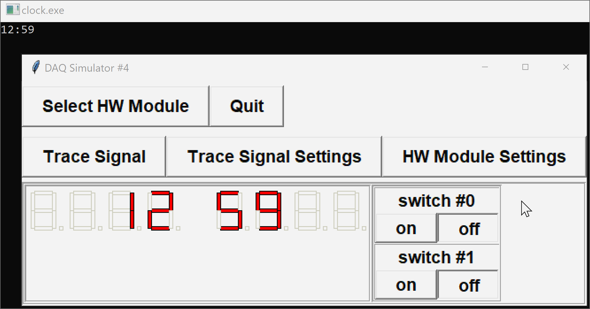

In this task, we will create a basic clock.



The DAQ module with configuration `4` has two digital input switches (`SWITCH01` and `SWITCH1`) and a set of 8 seven-segment displays (`DISPLAY0` - `DISPLAY7`).  We will ignore the input switches.  The seven-segment displays are arranged in reverse order, so that `DISPLAY0` is the furthest to the right.  Each seven-segment display is driven by an integer which lights up particular segments according to:


We will use the middle four display units to show the time in 12-hour format.  The program should operate as follows:

- Read the starting hours and minutes from standard input using the format `"%d:%d"`.  This must be done *before* initializing the DAQ.
- Initialize the DAQ with setup number `4` and check if successful
- Display the initial time using the middle four displays
- Update the time every minute so that the clock continues to display the correct time in 12-hour format

The program should continue running until the user quits the simulator.

You are provided with the following functions in the DAQlib library:

- `int setupDAQ(int setupNum)`: initializes the device with the provided configuration number, returns 1 on success and 0 on failure.
- `int continueSuperLoop(void)`: checks the status of the device, returning 1 if ready and 0 if the device was shut down.
- `void delay(unsigned long milliseconds)`: pauses the program for the specified number of milliseconds.
- `unsigned long millis(void)`: returns the number of milliseconds passed since the program started.

For full marks you will need write your program in such a way that avoids *drift* (i.e. slowly diverging away from the correct time).

---

## Evaluation

You should be able to test your program using the usual DAQ simulator.  

Your code will be evaluated using a modified command-line simulator (see the attached `DAQlibTerminalTiming.c` file).  The program is set to read and write values using standard I/O.

**NOTE:** the command-line simulator will handle most of the inputs/outputs for you.  Do not include your own `printf`/`scanf` statements, except in reading the initial time.

### Input Format

Program inputs will be read from standard input.

The first input line will contain the start time in the format `"%d:%d"`, representing hours and minutes.

The command-line simulator will then read a set of times and sensor values.

Each line contains
- the time of the next event (seconds)
- the new values for all input channels at the time of the event

For example,
```default
12:59
1.00 0 0
61.00 0 0
121.00 0 0
181.00 0 0
241.00 0 0
```
initializes the time to `12:59`, and then indicates that event times occur after 1 second, 61 seconds, 121 seconds, 181 seconds, and 241 seconds.  The switches - which are to be ignored - are `OFF` at all these times.

The program will continue reading times and inputs until either no more data remains, or the next item is invalid (e.g. not a number).  At that point, `continueSuperLoop()` will return `FALSE` and the program should exit.

### Output Format

The first line in the output will contain the DAQ setup number, which is printed by the command-line simulator.

At each event time specified in the input file, the simulator will print the current time to 2 decimal places, followed by the values of all displays at that time.

---

## Sample

### Input
```default
12:59
1.00 0 0
61.00 0 0
121.00 0 0
181.00 0 0
241.00 0 0
```

### Output
```default
4
1.00
              _   _   _          
           |  _| |_  |_|         
           | |_   _|  _|         
 ___ ___ ___ ___ ___ ___ ___ ___ 
61.00
                  _   _          
               | | | | |         
               | |_| |_|         
 ___ ___ ___ ___ ___ ___ ___ ___ 
121.00
                  _              
               | | |   |         
               | |_|   |         
 ___ ___ ___ ___ ___ ___ ___ ___ 
181.00
                  _   _          
               | | |  _|         
               | |_| |_          
 ___ ___ ___ ___ ___ ___ ___ ___ 
241.00
                  _   _          
               | | |  _|         
               | |_|  _|         
 ___ ___ ___ ___ ___ ___ ___ ___ 
```

### Explanation

When the DAQ is initialized, the command-line simulator will print the setup number 4 to the current line.

After this, the output shows the event times and corresponding clock display outputs.

---

### Testing

You should be able to run and test your program at home or in the lab with the regular simulator.

To try with the command-line simulator, download the file `DAQlibTerminalTiming.c` from the attachments section and add it to your project.  Note that you will still need to create a project of type `APSC160 - DAQ` so that your program can find the appropriate `<DAQlib.h>` header.  

If you do not have the library and simulator installed, you can manually add the `DAQlib.h` header.  Download `DAQlib.h` from the attachments, add it to your project, and include it using double-quotes rather than `<>`:

```c
#include "DAQlib.h"
```

The double-quotes informs the compiler to search for the header in the current directory, whereas the angle-brackets tell the compiler to search for the header in a set of system-dependent paths.

### Program Inputs

The command-line simulator will read times and DAQ inputs from standard input.  To make it easier to test your programs with various inputs, you can set `stdin` to read from a text file rather than from the console window.

To redirect input from a file, enter the following command at the start of your `main(...)` function, 
```c
   freopen("input.txt", "r", stdin);  /* redirect input from file */
```
where the file `input.txt` is the desired input file.  **Remember to remove this line before submission.**

