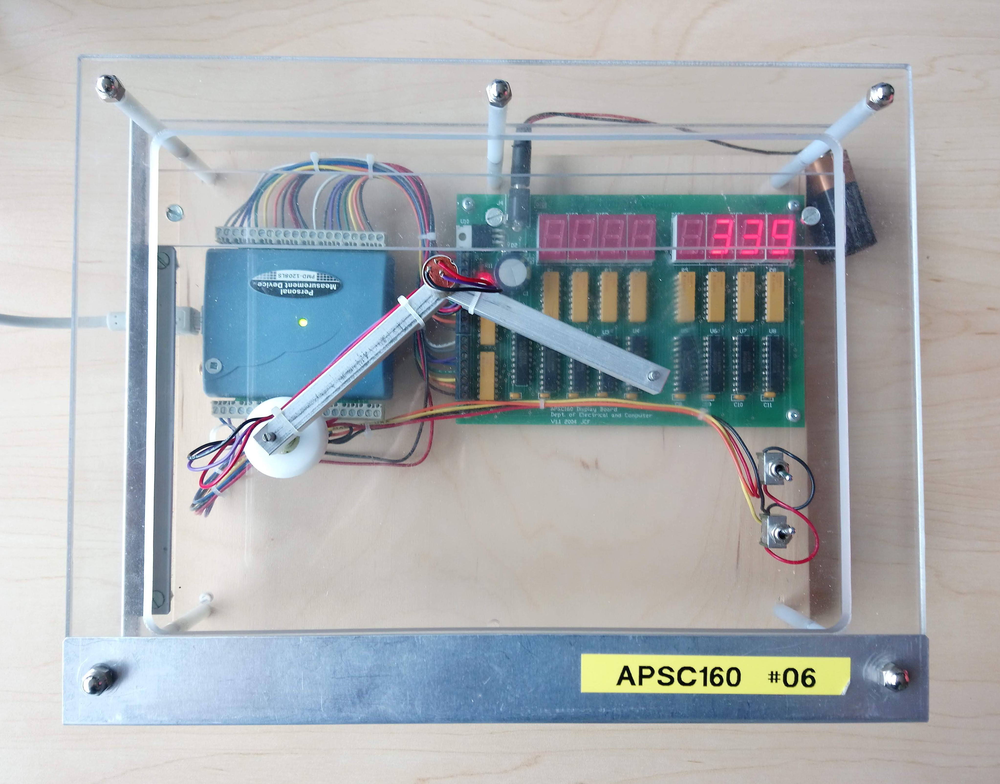

The DAQ hardware module is a 2D digitizer, designed to record $(x,y)$-coordinates of the tip of a jointed mechanical arm.  The joints themselves contain rotary potentiometers to encode the their relative angle as a voltage, which can be read through analog input channels.



The module has two input toggle-switches (digital input channels 0 and 1), a potentiometer for measuring the joint angle at the base of the arm (analog input channel 0), a potentiometer for measuring the joint angle at the elbow of the arm (analog input channel 1), and a set of eight 7-segment displays for displaying values.  The seven-segment displays are arranged in reverse order, so that display at position 0 is the furthest to the right.

To compute angles given voltages, consider the following diagram:


By carefully measuring voltages and angles, you determine the following calibration relationships between voltages and angles of the arm base and elbow:


You also carefully measure the arms to have lengths of 8.5 cm from point `A` to point `B`, and from point `B` to point `C`.  Using basic trigonometry, you determine the relationship between joint angles and positions $(x,y)$ to be given by

$$\begin{aligned}\theta_2 & = \theta_1 + \theta_3 - \pi\\x & = AB\cos(\theta_1) + BC\cos(\theta_2)\\y & = AB\sin(\theta_1) + BC\sin(\theta_2)\end{aligned}$$

Write a program that does the following:

- Prompt the user to enter a setup number to either run on the hardware or simulator: 
   - `"Enter the DAQ setup number (0 for hardware, 7 for simulator): "`
- Initialize the device with the provided setup number
- Repeat the following every *500 ms* while the device/simulator is still running
   - If `SWITCH0` is `OFF`, then turn off all displays
   - If `SWITCH0` is `ON`, then
      - If `SWITCH1` is `OFF`, display the voltages of the two potentiometers on the displays in units of *millivolts*, with the left-most four displays showing the base voltage and the right-most four displays showing the elbow voltage
      - If `SWITCH1` is `ON`, display the $x$ and $y$ position of the digitizer tip in units of *millimetres*, with the left-most four displays showing the $x$ position and the right-most four displays showing the $y$ position

When displaying values, round up to the nearest non-negative integer (i.e. -2 is rounded up to 0 and 2.5 is rounded up to 3).  Do not include leading zeroes unless the number is zero (i.e. 142 instead of 0142).

You are provided with the following functions in the DAQlib library:

- `int setupDAQ(int setupNum)`: initializes the device with the provided configuration number, returns 1 on success and 0 on failure.
- `int continueSuperLoop(void)`: checks the status of the device, returning 1 if ready and 0 if the device was shut down.
- `int digitalRead(int channel)`: reads a digital value from the given digital input channel.
- `double analogRead(int channel)`: reads an analog voltage from the given analog input channel.
- `void displayWrite(int val, int position)`: writes a binary-encoded value to the given display position to turn on/off the corresponding LED.
- `void delay(unsigned long milliseconds)`: pauses the program for the specified number of milliseconds.
- `unsigned long millis(void)`: returns the number of milliseconds passed since the program started.

---

## Evaluation

You should be able to test your program using the usual DAQ simulator.  

Your code will be evaluated using a modified command-line simulator (see the attached `DAQlibTerminalTiming.c` file).  The program is set to read and write values using standard I/O.

**NOTE:** the command-line simulator will handle most of the inputs/outputs for you.  Do not include your own `printf`/`scanf` statements, except in initially prompting the user for a setup number and reading the result.

### Input Format

The first line will contain the setup number to use (`0` or `7`).

The rest of the input file will consist of values to be read by the command-line simulator, consisting of set of times and sensor values.

Each line contains
- the time of the next event (seconds)
- the new values for all input channels at the time of the event (in this case, the values of the two digital input switches, followed by the voltages for the two arm joints)

The program will continue reading times and inputs until either no more data remains, or the next item is invalid (e.g. not a number).  At that point, `continueSuperLoop()` will return `FALSE` and the program should exit.

### Output Format

The first line in the output will contain the user-prompt and the supplied DAQ setup number.

At each event time specified in the input file, the command-line simulator will print the current time to 2 decimal places, followed by the values of all outputs and displays *just prior* to the event (i.e. outputs do not reflect changes occuring *at* the given time).

---

## Sample 1

### Input
```default
0
0.25 1 0 2.0 2.0
0.75 1 1 2.0 2.0
1.25 0 1 2.5 2.5
1.75 1 1 2.5 2.5
2.25 1 0 2.5 2.5
2.75 0 0 2.5 2.5
```

### Output
```default
Enter the DAQ setup number (0 for hardware, 7 for simulator): 0
0.25
                                 
                                 
                                 
 ___ ___ ___ ___ ___ ___ ___ ___ 
0.75
  _   _   _   _   _   _   _   _  
  _| | | | | | |  _| | | | | | | 
 |_  |_| |_| |_| |_  |_| |_| |_| 
 ___ ___ ___ ___ ___ ___ ___ ___ 
1.25
          _   _                  
       | |_   _|         |_|   | 
       | |_|  _|           |   | 
 ___ ___ ___ ___ ___ ___ ___ ___ 
1.75
                                 
                                 
                                 
 ___ ___ ___ ___ ___ ___ ___ ___ 
2.25
          _   _               _  
       | |_  |_              | | 
       |  _|  _|             |_| 
 ___ ___ ___ ___ ___ ___ ___ ___ 
2.75
  _   _   _   _   _   _   _   _  
  _| |_  | | | |  _| |_  | | | | 
 |_   _| |_| |_| |_   _| |_| |_| 
 ___ ___ ___ ___ ___ ___ ___ ___ 
```

### Explanation

The user-prompt is first printed to the screen, followed by the setup number which is echoed by the command-line simulator.

Using the above equations relating voltages to angles to positions, we have

| Base (mV) | Elbow (mV) | $theta_1$ ($\circ$) | $theta_3$ ($\circ$) | $theta_2$ ($\circ$) | $x$ (mm) | $y$ (mm) |
|---------|----------|--------|----------|---------|---------|---------|
|   2000  |   2000   |  5.06  |  198.18  |  23.24  |  162.8  |  41.04  |
|   2500  |   2500   | -19.89 |  172.48  | -27.41  |  155.4  | -68.05  |

Recall that values from the input take effect just after the provided time in the input file, so the corresponding DAQ outputs will be reflected at the *next* event time.

The displays are initially blank since `SWITCH0` is initially `OFF`.  At 0.25 seconds, the switches are set to display voltages in mV, which is reflected in the output at 0.75 seconds.  Next, the switches are set to display the rounded $x$ and $y$ positions.  For input voltages of 2.5 V, the corresponding $y$ value is negative, which is rounded up to zero as described in the instructions.

---

## Sample 2

See the attachments section for `sample_input_star.txt` and `sample_output_star.txt` which demonstrate an input-output pair for displaying the $(x,y)$ coordinates of a star shape traced using the DAQ.

### Testing

You should be able to run and test your program at home or in the lab with the regular simulator.  Code that works perfectly on the simulator should also work perfectly on the command-line simulator used for evaluation.

To try with the command-line simulator, download the file `DAQlibTerminalTiming.c` from the attachments section and add it to your project.  Note that you will still need to create a project of type `APSC160 - DAQ` so that your program can find the appropriate `<DAQlib.h>` header.  

If you do not have the library and simulator installed, you can manually add the `DAQlib.h` header.  Download `DAQlib.h` from the attachments, add it to your project, and include it using double-quotes rather than `<>`:

```c
#include "DAQlib.h"
```

The double-quotes informs the compiler to search for the header in the current directory, whereas the angle-brackets tell the compiler to search for the header in a set of system-dependent paths.

### Program Inputs

The command-line simulator will read times and DAQ inputs from standard input.  To make it easier to test your programs with various inputs, you can set `stdin` to read from a text file rather than from the console window.

To redirect input from a file, enter the following command at the start of your `main(...)` function, 
```c
   freopen("input.txt", "r", stdin);  /* redirect input from file */
```
where the file `input.txt` is the desired input file.  **Remember to remove this line before submission.**

