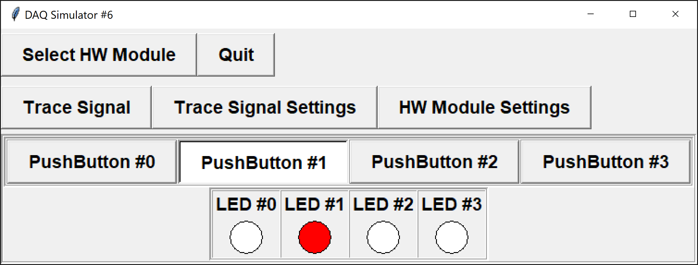

The DAQ module with configuration `6` has four digital inputs (push-buttons) and four digital outputs (LEDs):

<table align="center">
	<tr><td><code>BUTTON0</code> - digital input channel 0</td><td><code>LED0</code> - digital output channel 0</td></tr>
	<tr><td><code>BUTTON1</code> - digital input channel 1</td><td><code>LED1</code> - digital output channel 1</td></tr>
	<tr><td><code>BUTTON2</code> - digital input channel 2</td><td><code>LED2</code> - digital output channel 2</td></tr>
	<tr><td><code>BUTTON3</code> - digital input channel 3</td><td><code>LED3</code> - digital output channel 3</td></tr>
</table>

Write a program that continuously reads the status of the push-buttons and turns on the corresponding LEDs if pressed.  If a button is not pressed, then its corresponding LED should remain off.



For example, if only `BUTTON1` is pressed, then `LED1` should be `ON` (1), and all other LEDs should be `OFF` (0).

Initialize the module to use configuration `6` *without prompting the user*, and check whether the device is ready before processing inputs/outputs.  You will need to define any constants used (i.e. `BUTTONX` and `LEDX` are not yet defined).

You are provided with the following functions:

- `int setupDAQ(int setupNum)`: initializes the device with the provided configuration number, returns `1` on success and `0` on failure
- `int continueSuperLoop(void)`: checks the status of the device, returning `1` if ready and `0` if the device was shut down
- `int digitalRead(int channel)`: reads and returns a digital value from the given digital input channel
- `void digitalWrite(int channel, int val)`: writes a digital value to the given digital output channel

## Input Format

**NOTE:** reading from the standard input is handled for you by the provided `DAQlib` library.

For the command-line simulator, each line in the input corresponds to the values of the input sensors at the beginning of each iteration of the "super" loop.  In this case, the values correspond to the states of the four digital push-buttons.

## Output Format

**NOTE:** the output is handled for you by the provided `DAQlib` library.

Outputs in the command-line simulator are as follows:
- The first line consists of the setup number used to initialize the device
- Each following line shows the digital output values at the start of each super-loop iteration, which in this case corresponds to the states of the four LEDs

---

## Sample

### Input
```
1 0 0 0
0 1 1 0
0 0 0 1
0 0 0 0
```

### Output

```
6
 0 0 0 0
 1 0 0 0
 0 1 1 0
 0 0 0 1
 0 0 0 0
```

### Explanation

The module was first initialized successfully with setup number `6`, without any prompts.

At the start of the first super-loop, all LEDs begin in the `OFF` state, leading to an output line of all zeroes.  The remaining lines echo the input push-button states.  If the $i$th button is `ON` in each iteration, then the $i$th LED is also `ON`.

When there are no more lines of input, the program should exit.

---

### Testing

You should be able to run and test your program at home or in the lab with the regular simulator.

To try with the command-line simulator, download the file `DAQlibTerminal.c` from the attachments section and add it to your project.  Note that you will still need to create a project of type `APSC160 - DAQ` so that your program can find the appropriate `<DAQlib.h>` header.  

If you do not have the library and simulator installed, you can manually add the `DAQlib.h` header.  Download `DAQlib.h` from the attachments, add it to your project, and include it using double-quotes rather than `<>`:

```c
#include "DAQlib.h"
```

The double-quotes informs the compiler to search for the header in the current directory, whereas the angle-brackets tell the compiler to search for the header in a set of system-dependent paths.