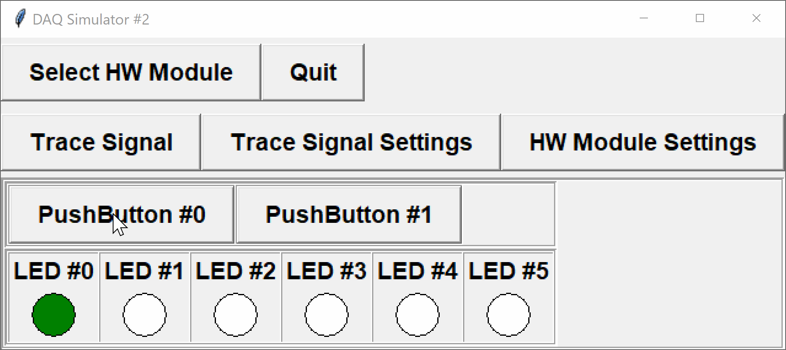

The DAQ module with configuration `2` has two digital inputs (push-buttons) and six digital outputs (LEDs):

- `BUTTON0` - digital input channel 0
- `BUTTON1` - digital input channel 1
- `LED0` - digital output channel 0
- `LED1` - digital output channel 1
- `LED2` - digital output channel 2
- `LED3` - digital output channel 3
- `LED4` - digital output channel 4
- `LED5` - digital output channel 5

Write a program that continuously reads the values of the push-buttons, then rotates 
which LED is `ON` according to the following rules:
```
-----------------------------------------
 BUTTON0  BUTTON1 |   ROTATION DIRECTION
-----------------------------------------
   OFF      OFF   |        STOPPED
   ON       OFF   |        LEFT
   OFF      ON    |        RIGHT
   ON       ON    |        STOPPED
-----------------------------------------
```



Before the first super-loop iteration, start with `LED0`  in the `ON` state (value 1) and all others `OFF` (value 0).  For subsequent iterations, the LED that is `ON` depends on the previous state:

- Rotating `LEFT`:
  - `001000 --> 010000 --> 100000 --> 000001 --> 000010 ...`  
- Rotating `RIGHT`:
  - `001000 --> 000100 --> 000010 --> 000001 --> 100000 ...`
  
Notice that the light wraps around when it gets to the end.

Make sure to first initialize the module to use configuration `2`, and check whether the device is ready before processing inputs/outputs.  You will need to define any constants used (i.e. `BUTTONX` and `LEDX` are not yet defined).

You are provided with the following functions:

- `int setupDAQ(int setupNum)`: initializes the device with the provided configuration number, returns `1` on success and `0` on failure
- `int continueSuperLoop(void)`: checks the status of the device, returning `1` if ready and `0` if the device was shut down
- `int digitalRead(int channel)`: reads and returns a digital value from the given digital input channel
- `void digitalWrite(int channel, int val)`: writes a digital value to the given digital output channel
- `void delay(unsigned long milliseconds)` - pauses the program for the specified number of milliseconds

### Notes:

- Since each iteration depends on the previous, you will need to store the current "state"
- You will also need to initialize the LEDs before the first loop iteration
- You may find the [modulo operator](https://en.wikipedia.org/wiki/Modulo_operation) useful
  - This is often used when wrapping integers around
  - Be wary of negative numbers and subtracting, as the modulo operator may not work as expected

If running this program on the simulator, you may wish to insert a `Sleep(...)` command to slow down the rotations.  On Windows, you will need to include the header file `<Windows.h>`.  On macOS or Linux, you need to include `<unistd.h>`.  For example, the following code will cause the program to sleep for 500ms:

**Windows:**
```c
#include <Windows.h>
Sleep(500);        /* input is time in milliseconds */
```

**OSX/Linux:**
```c
#include <unistd.h>
usleep(500*1000);  /* input is time in microseconds */
```

You may also use the built-in `delay(...)` function on the DAQ, which will work independent of your operating system.

## Input Format

**NOTE:** reading from standard input is handled for you by the provided `DAQlib` library.

For the command-line simulator, each line in the input corresponds to the values of the input sensors at each call to `continueSuperLoop()`.  In this case, the values correspond to the states of the two digital push-buttons.

## Ouput Format

**NOTE:** the output is handled for you by the provided `DAQlib` library.

For the command-line simulator, the first line in the output corresponds to the setup number used to initialize the DAQ.  Each following line in the output shows the status of the six LEDs at the next call to `continueSuperLoop()`.

---

## Sample

### Input
```default
0 0
1 0
1 0
1 0
1 1
1 1
1 1
0 1
0 1
0 1
```

### Output

```default
2
 1 0 0 0 0 0
 1 0 0 0 0 0
 0 0 0 0 0 1
 0 0 0 0 1 0
 0 0 0 1 0 0
 0 0 0 1 0 0
 0 0 0 1 0 0
 0 0 0 1 0 0
 0 0 0 0 1 0
 0 0 0 0 0 1
 1 0 0 0 0 0
```

### Explanation

- At the start of the first super-loop iteration, only `LED0` is `ON` (initialization)
- The first input line `0 0` tells us *not* to rotate, so the LEDs remain at `100000`
- The second input line `1 0` tells us to rotate left, but since the left-most LED is already lit, we need to wrap around to `000001`
- We continue shifting left for input lines three and four until we get `000100`
- The fifth input line `1 1` tells us to stop rotating again, so we remain at `000100`
- The eighth input line `0 1` tells us to rotate right, so we shift the state to `000010`
- We continue shifting right, wrapping around until there are no more inputs