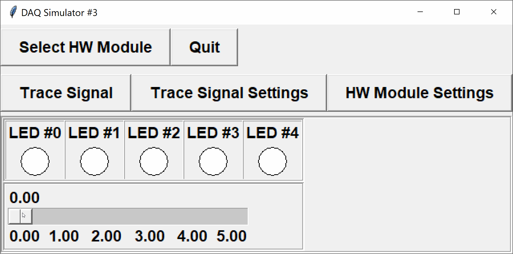

The DAQ simulator with configuration 3 has a sliding potentiometer and 5 LEDs.  The slider is attached to analog input channel 0, and the LEDs on digital output channels 0 through 4.



Write a simple program that reads the voltage from the potentiometer, and turns on all LEDs up to the rounded voltage value minus one (i.e. zero volts corresponds to all LEDs `OFF`, and five volts to all LEDs `ON`).  For example, an input voltage of 2.30 volts would light up LEDs 0 and 1.  An input voltage of 3.62 volts would light up LEDs 0, 1, 2, and 3.  You may assume that midpoints between voltages round up (i.e. 2.5 rounds up to 3.00).  If the voltage is negative, turn all LEDs `OFF`, and if the voltage is greater than or equal to 5.5 V, turn all LEDs `ON`.

You are provided with the following functions in the DAQlib library:

- `int setupDAQ(int setupNum)`: initializes the device with the provided configuration number, returns 1 on success and 0 on failure.
- `int continueSuperLoop(void)`: checks the status of the device, returning 1 if ready and 0 if the device was shut down.
- `void digitalWrite(int channel, int val)`: writes a digital value to the given digital output channel.
- `double analogRead(int channel)`: reads an analog voltage from the given analog input channel.

---

## Evaluation

You should be able to test your program using the usual DAQ simulator.  

Your code will be evaluated using a modified command-line simulator (see the attached `DAQlibTerminalTiming.c` file).  The program is set to read and write values using standard I/O.

**NOTE:** the command-line simulator will handle all of the inputs/outputs for you.  Do not include your own `printf`/`scanf` statements.

### Input Format

The command-line simulator will read a set of times and sensor values.

Each line contains
- the time of the next event (seconds)
- the new values for all input channels at the time of the event (in this case, the single analog voltage)

The program will continue reading times and inputs until either no more data remains, or the next item is invalid (e.g. not a number).  At that point, `continueSuperLoop()` will return `FALSE` and the program should exit.

### Output Format

The first line in the output will contain the DAQ setup number, which is printed by the command-line simulator.

At each event time specified in the input file, the simulator will print the current time to 2 decimal places, followed by the values of all outputs and displays *just prior* to the event (i.e. outputs do not reflect changes occuring *at* the given time).

---

## Sample

### Input
```default
1.0 2.30
2.0 3.62
3.0 1.00
4.0 0.00
5.0 2.99
```

### Output
```default
3
1.00 0 0 0 0 0
2.00 1 1 0 0 0
3.00 1 1 1 1 0
4.00 1 0 0 0 0
5.00 0 0 0 0 0
```

### Explanation

When the DAQ is initialized, the command-line simulator will print the setup number `3` to the current line.

After this, the output shows the event times and corresponding LED outputs.
- At 1.00 seconds, the analog voltage of the potentiometer was previously zero (from initialization), so all LEDs should be `OFF`.  The analog voltage is then set to 2.30 V.
- At 2.00 seconds, the voltage was initially 2.30 V - which rounds down to 2 V - so the first two LEDs should be `ON`.  The analog voltage is then set to 3.62 V.
- At 3.00 seconds, the voltage was 3.62 V - which rounds up to 4 V - so the first four LEDs should be `ON`.  The voltage is then set to 1.00 V.
- At 4.00 seconds, the voltage was 1.00 V, so only the first LED should be `ON`.  The voltage is then set to 0.00 V.
- at 5.00 seconds, the voltage was 0.00 V, so all LEDs should be `OFF`.  The potentiometer voltage is then set to 2.99 V.
---

### Testing

You should be able to run and test your program at home or in the lab with the regular simulator.  Code that works perfectly on the simulator should also work perfectly on the command-line simulator used for evaluation.

To try with the command-line simulator, download the file `DAQlibTerminalTiming.c` from the attachments section and add it to your project.  Note that you will still need to create a project of type `APSC160 - DAQ` so that your program can find the appropriate `<DAQlib.h>` header.  

If you do not have the library and simulator installed, you can manually add the `DAQlib.h` header.  Download `DAQlib.h` from the attachments, add it to your project, and include it using double-quotes rather than `<>`:

```c
#include "DAQlib.h"
```

The double-quotes informs the compiler to search for the header in the current directory, whereas the angle-brackets tell the compiler to search for the header in a set of system-dependent paths.

### Program Inputs

The command-line simulator will read times and DAQ inputs from standard input.  To make it easier to test your programs with various inputs, you can set `stdin` to read from a text file rather than from the console window.

To redirect input from a file, enter the following command at the start of your `main(...)` function, 
```c
   freopen("input.txt", "r", stdin);  /* redirect input from file */
```
where the file `input.txt` is the desired input file.  **Remember to remove this line before submission.**

