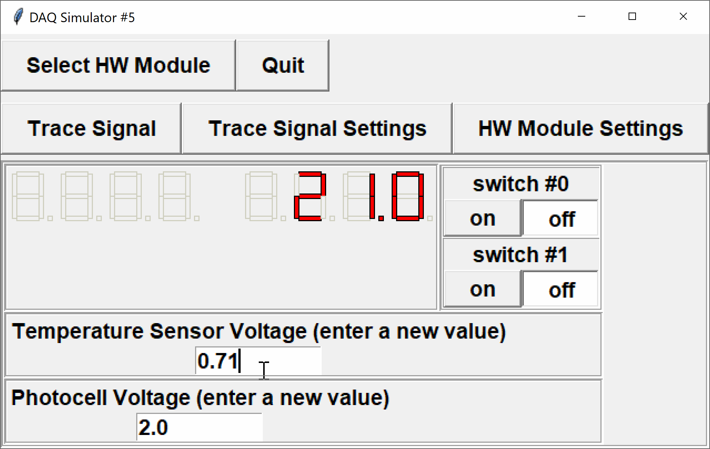

The DAQ simulator with configuration 5 has two digital input switches (digital input channels 0 and 1), a temperature sensor (analog input channel 0) and a light sensor (analog input channel 1).  We will ignore the switches and the light sensor.

Write a program that reads from the temperature sensor, converts the voltage values to temperature in degrees Celsius, and displays the converted value on a set of 7-segment displays.



The temperature sensor (e.g. TMP36), has a linear relationship between measured voltage and ambient temperature.  According to the [datasheet](https://www.analog.com/media/en/technical-documentation/data-sheets/tmp35_36_37.pdf), 

$$T_C & = 100 *(\mathrm{voltage) - 0.5),$$

where $T_C$ is temperature in Celsius, and voltage is measured in units of volts.  Temperature should be written accurate to *one decimal place* (i.e. rounded to the nearest 0.1$^\circ C$).  To round, follow the rules of the `round(...)` function found in `<math.h>`.  For full marks, your program should also work for negative temperatures.

You are provided with the following functions in the DAQlib library:

- `int setupDAQ(int setupNum)`: initializes the device with the provided configuration number, returns 1 on success and 0 on failure.
- `int continueSuperLoop(void)`: checks the status of the device, returning 1 if ready and 0 if the device was shut down.
- `void displayWrite(int val, int position)`: writes a binary-encoded value to the given display position to turn on/off the corresponding LED.
- `double analogRead(int channel)`: reads an analog voltage from the given analog input channel.

---

## Evaluation

You should be able to test your program using the usual DAQ simulator.  

Your code will be evaluated using a modified command-line simulator (see the attached `DAQlibTerminalTiming.c` file).  The program is set to read and write values using standard I/O.

**NOTE:** the command-line simulator will handle all of the inputs/outputs for you.  Do not include your own `printf`/`scanf` statements.

### Input Format

The command-line simulator will read a set of times and sensor values.

Each line contains
- the time of the next event (seconds)
- the new values for all input channels at the time of the event (in this case, the values of the two digital input switches, followed by the temperature sensor voltage and the light sensor voltage)

The program will continue reading times and inputs until either no more data remains, or the next item is invalid (e.g. not a number).  At that point, `continueSuperLoop()` will return `FALSE` and the program should exit.

### Output Format

The first line in the output will contain the DAQ setup number, which is printed by the command-line simulator.

At each event time specified in the input file, the simulator will print the current time to 2 decimal places, followed by the values of all outputs and displays *just prior* to the event (i.e. outputs do not reflect changes occuring *at* the given time).

---

## Sample

### Input
```default
0.00 0 0 0.710 0.00
1.00 0 0 0.720 0.00
2.00 0 0 0.6851 0.00
3.00 0 0 0.6855 0.00
4.00 0 0 0.6855 0.00
```

### Output
```default
5
0.00
                                 
                                 
                                 
 ___ ___ ___ ___ ___ ___ ___ ___ 
1.00
                      _       _  
                      _|   | | | 
                     |_    |.|_| 
 ___ ___ ___ ___ ___ ___ ___ ___ 
2.00
                      _   _   _  
                      _|  _| | | 
                     |_  |_ .|_| 
 ___ ___ ___ ___ ___ ___ ___ ___ 
3.00
                          _   _  
                       | |_| |_  
                       | |_|. _| 
 ___ ___ ___ ___ ___ ___ ___ ___ 
4.00
                          _   _  
                       | |_| |_  
                       | |_|.|_| 
 ___ ___ ___ ___ ___ ___ ___ ___ 
```

### Explanation

When the DAQ is initialized, the command-line simulator will print the setup number `5` to the current line.

After this, the output shows the event times and corresponding temperatures.
- At 0.00 seconds, all displays should be off from initialization.  The analog voltage is then set to 0.710 V.
- At 1.00 seconds, the voltage was initially 0.710 V, which corresponds to the temperature 21.0 Celsius, shown on the displays.  The analog voltage is then set to 0.720 V.
- At 2.00 seconds, the voltage was initially 0.720 V, which corresponds to the temperature 22.0 Celsius, shown on the displays.  The analog voltage is then set to 0.6851 V.
- At 3.00 seconds, the voltage was initially 0.6851 V, which corresponds to the temperature 18.51 Celsius, which rounds to the 18.5 shown on the displays.  The analog voltage is then set to 0.6855 V.
- At 4.00 seconds, the voltage was initially 0.6855 V, which corresponds to the temperature 18.55 Celsius, which rounds up to 18.6 shown on the displays.
---

### Testing

You should be able to run and test your program at home or in the lab with the regular simulator.  Code that works perfectly on the simulator should also work perfectly on the command-line simulator used for evaluation.

To try with the command-line simulator, download the file `DAQlibTerminalTiming.c` from the attachments section and add it to your project.  Note that you will still need to create a project of type `APSC160 - DAQ` so that your program can find the appropriate `<DAQlib.h>` header.  

If you do not have the library and simulator installed, you can manually add the `DAQlib.h` header.  Download `DAQlib.h` from the attachments, add it to your project, and include it using double-quotes rather than `<>`:

```c
#include "DAQlib.h"
```

The double-quotes informs the compiler to search for the header in the current directory, whereas the angle-brackets tell the compiler to search for the header in a set of system-dependent paths.

### Program Inputs

The command-line simulator will read times and DAQ inputs from standard input.  To make it easier to test your programs with various inputs, you can set `stdin` to read from a text file rather than from the console window.

To redirect input from a file, enter the following command at the start of your `main(...)` function, 
```c
   freopen("input.txt", "r", stdin);  /* redirect input from file */
```
where the file `input.txt` is the desired input file.  **Remember to remove this line before submission.**

