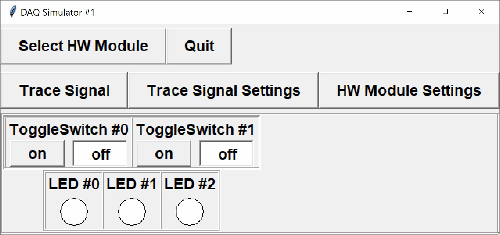

The DAQ simulator with setup number `1` has two toggle-switches and three LEDs:

<table align="center">
	<tr><td><code>SWITCH0</code> - digital input channel 0</td><td><code>LED0</code> - digital output channel 0</td></tr>
	<tr><td><code>SWITCH1</code> - digital input channel 1</td><td><code>LED1</code> - digital output channel 1</td></tr>
	<tr><td></td><td><code>LED2</code> - digital output channel 2</td></tr>
</table>

For this problem, we will ignore the input switches, and instead manipulate the state of the LEDs based on timing.

Write a program that turns on and off the LEDs at specific time intervals:
- turn `LED0` `ON` **one** second after the program starts, and *toggle* its state every **one** second thereafter (i.e. turn `OFF` at 2 seconds, `ON` at 3 seconds, etc...)
- turn `LED1` `ON` **two** seconds after the program starts, and *toggle* its state every **two** seconds thereafter
- turn `LED2` `ON` **three** seconds after the program starts, and *toggle* its state every **three** seconds thereafter



The program should continue running until the user quits the simulator.

Initialize the module to use configuration `1`, and check whether the device is ready before processing inputs/outputs. You are provided with the following functions in the DAQlib library:

- `int setupDAQ(int setupNum)`: initializes the device with the provided configuration number, returns 1 on success and 0 on failure.
- `int continueSuperLoop(void)`: checks the status of the device, returning 1 if ready and 0 if the device was shut down.
- `void digitalWrite(int channel, int val)`: writes a digital value to the given digital output channel.
- `unsigned long millis(void)` - returns the number of milliseconds passed since the program started.
- `void delay(unsigned long milliseconds)` - pauses the program for the specified number of milliseconds.

To implement the timing, you may also use any of the functions:
- `void Sleep(unsigned long milliseconds)` - the Windows sleep function, found in `<Windows.h>`.
- `unsigned int sleep(unsigned int seconds)` - the POSIX sleep function, found in `<unistd.h>` on macOS/Linux.
- `int usleep(unsigned long microseconds)` - the POSIX microsecond-sleep function, found in `<unistd.h>` on macOS/Linux.

**NOTE:** to receive full marks, you will need to ensure accuracy in the precise times the LEDs are switched on and off.

---

## Evaluation

You should be able to test your program using the usual DAQ simulator.  

Your code will be evaluated using a modified command-line simulator (see the attached `DAQlibTerminalTiming.c` file).  The program is set to read and write values using standard I/O.

**NOTE:** the command-line simulator will handle inputs/outputs for you.  Do not include your own `printf`/`scanf` statements.

### Input Format

The standard program has no inputs.

If using the command-line simulator, it will read the following values from standard input:
- the time of the next event (seconds)
- the new values for all input channels at the time of the event (to be ignored in this program)
Data will continue to be read until there is no more valid input.

For example
```default
0.5 0 0
1.5 0 0
2.5 0 0
3.5 0 0
4.5 0 0
5.5 0 0
6.5 0 0
7.5 0 0
8.5 0 0
9.5 0 0
```
will cause the program to print results starting at 0.5 seconds, every 1.0 seconds, until 9.5 seconds have elaspsed (i.e. at 0.5 s, 1.5 s, 2.5 s, etc...).  After 9.5 seconds, `continueSuperLoop()` will return `FALSE` since there is no more valid input, and the program should exit.

### Output Format

When the DAQ is first initialized, the command-line simulator will print the setup number used.

At each designated "process" time, as specified by the times in the input file, the simulator will print the current time to 2 decimal places, followed by the digital outputs.

---

## Sample

### Input
```default
0.5 0 0
1.5 0 0
2.5 0 0
3.5 0 0
4.5 0 0
5.5 0 0
6.5 0 0
7.5 0 0
8.5 0 0
9.5 0 0
```

### Output
```default
1
0.50 0 0 0
1.50 1 0 0
2.50 0 1 0
3.50 1 1 1
4.50 0 0 1
5.50 1 0 1
6.50 0 1 0
7.50 1 1 0
8.50 0 0 0
9.50 1 0 1
```

### Explanation

The DAQ was initialized with setup number `1`.  The remainder of the output consists of the desired mid-second times and LED values.

- `LED0` turns `ON` at 1 second, `OFF` at 2 seconds, `ON` at 3 seconds, `OFF` at 4 seconds, etc...
- `LED1` turns `ON` at 2 seconds, `OFF` at 4 seconds, `ON` at 6 seconds, etc...
- `LED1` turns `ON` at 3 seconds, `OFF` at 6 seconds, and `ON` at 9 seconds


---

### Testing

You should be able to run and test your program at home or in the lab with the regular simulator.

To try with the command-line simulator, download the file `DAQlibTerminalTiming.c` from the attachments section and add it to your project.  Note that you will still need to create a project of type `APSC160 - DAQ` so that your program can find the appropriate `<DAQlib.h>` header.  

If you do not have the library and simulator installed, you can manually add the `DAQlib.h` header.  Download `DAQlib.h` from the attachments, add it to your project, and include it using double-quotes rather than `<>`:

```c
#include "DAQlib.h"
```

The double-quotes informs the compiler to search for the header in the current directory, whereas the angle-brackets tell the compiler to search for the header in a set of system-dependent paths.

### Program Inputs

The command-line simulator will read times and DAQ inputs from standard input.  To make it easier to test your programs with various inputs, you can set `stdin` to read from a text file rather than from the console window.

To redirect input from a file, enter the following command at the start of your `main(...)` function, 
```c
   freopen("input.txt", "r", stdin);  /* redirect input from file */
```
where the file `input.txt` is the desired input file.  **Remember to remove this line before submission.**


