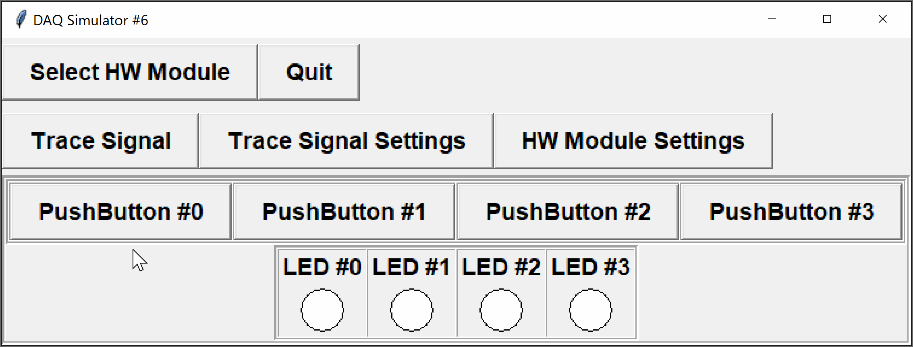

So far, when we have been using the digital inputs on the DAQ module, we read the current state and perform an action based on that state.   For example, if the button is pressed down (`ON`) then we turn the LED on.  Otherwise, we turn the LED off.

However, sometimes we are interested in a *change* in state. We may only want to perform an action when a button changes from being off to on, but do nothing if the button stays on or switches off.  Think about how a mouse button or keyboard button works.

In this challenge, you are going to implement a *toggle* behaviour for the button: when the button is initially pressed (i.e.~changes from `OFF` to `ON`), it will change the state of the corresponding LED.  Otherwise, the LED will remain in its current state.



The DAQ module with configuration `6` has four digital inputs (push-buttons) and four digital outputs (LEDs):

<table align="center">
	<tr><td><code>BUTTON0</code> - digital input channel 0</td><td><code>LED0</code> - digital output channel 0</td></tr>
	<tr><td><code>BUTTON1</code> - digital input channel 1</td><td><code>LED1</code> - digital output channel 1</td></tr>
	<tr><td><code>BUTTON2</code> - digital input channel 2</td><td><code>LED2</code> - digital output channel 2</td></tr>
	<tr><td><code>BUTTON3</code> - digital input channel 3</td><td><code>LED3</code> - digital output channel 3</td></tr>
</table>

All LEDs start in the `OFF` state, as do all buttons. When `BUTTONX` is pressed, it should toggle the state of `LEDX` (i.e.~if `LED1` is `ON` then pressing `BUTTON1` should turn it `OFF`). Holding a button down has no effect.

Initialize the module to use configuration `6` *without prompting the user*, and check whether the device is ready before processing inputs/outputs.  You will need to define any constants used (i.e. `BUTTONX` and `LEDX` are not yet defined).  You are provided with the following functions in the DAQlib library:

- `int setupDAQ(int setupNum)`: initializes the device with the provided configuration number, returns 1 on success and 0 on failure.
- `int continueSuperLoop(void)`: checks the status of the device, returning 1 if ready and 0 if the device was shut down.
- `void digitalRead(int channel)`: reads a digital value from the given digital input channel.
- `void digitalWrite(int channel, int val)`: writes a digital value to the given digital output channel.

The digital values of the push-buttons correspond to `OFF` (0) and `ON` (1).

## Input Format

**NOTE:** reading from the standard input is handled for you by the provided `DAQlib` library.

For the command-line simulator, each line in the input corresponds to the values of the input sensors at the beginning of each iteration of the "super" loop.  In this case, the values correspond to the states of the four digital push-buttons.

## Output Format

**NOTE:** the output is handled for you by the provided `DAQlib` library.

Outputs in the command-line simulator are as follows:
- The first line consists of the setup number used to initialize the device
- Each following line shows the digital output values at the start of each super-loop iteration, which in this case corresponds to the states of the four LEDs

---

## Sample

### Input
```
1 0 0 0
1 0 0 0
0 1 1 0
0 0 0 0
1 1 1 0
```

### Output

```
6
 0 0 0 0
 1 0 0 0
 1 0 0 0
 1 1 1 0
 1 1 1 0
 0 0 0 0
```

### Explanation

The module was first initialized successfully with setup number `6`, without any prompts.

At the start of the first super-loop, all LEDs begin in the `OFF` state, leading to an output line of all zeroes.  

For the remaining lines in the output, the input lines cause the LEDs to toggle:
- in the first input line, `BUTTON0` switches from `OFF` to `ON`, which then triggers `LED0` to switch on
- in the second input line, `BUTTON0` remains `ON`, so the output is not changed
- in the third input line, `BUTTON1` and `BUTTON2` switch from `OFF` to `ON`, toggling `ON` the corresponding LEDs.  `LED0` remains on
- in the fourth input line, all buttons are switched `OFF`, so the LEDs keep their state
- in the last input line, `BUTTON0` -- `BUTTON2` all switch from `OFF` to `ON`, so the three LEDs toggle from `ON` to `OFF` 

When there are no more lines of input, the program should exit.

---

### Testing

You should be able to run and test your program at home or in the lab with the regular simulator.

To try with the command-line simulator, download the file `DAQlibTerminal.c` from the attachments section and add it to your project.  Note that you will still need to create a project of type `APSC160 - DAQ` so that your program can find the appropriate `<DAQlib.h>` header.  

If you do not have the library and simulator installed, you can manually add the `DAQlib.h` header.  Download `DAQlib.h` from the attachments, add it to your project, and include it using double-quotes rather than `<>`:

```c
#include "DAQlib.h"
```

The double-quotes informs the compiler to search for the header in the current directory, whereas the angle-brackets tell the compiler to search for the header in a set of system-dependent paths.