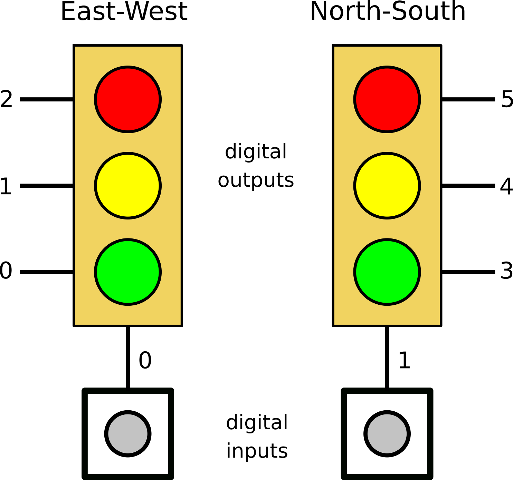
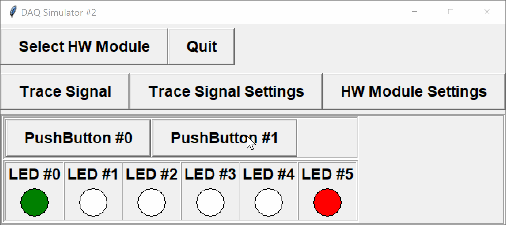

The DAQ module with configuration `2` has two digital inputs (push-buttons) and six digital outputs (LEDs):

- `BUTTON0` - digital input channel 0
- `BUTTON1` - digital input channel 1
- `LED0` - GREEN - digital output channel 0
- `LED1` - YELLOW - digital output channel 1
- `LED2` - RED - digital output channel 2
- `LED3` - GREEN - digital output channel 3
- `LED4` - YELLOW - digital output channel 4
- `LED5` - RED - digital output channel 5

We will use this to simulate a traffic-light system, with two sensors to detect when a pedestrian or vehicle is waiting (one button for each perpendicular direction).



The first three LEDs correspond to the Green-Yellow-Red lights in the East-West direction.  The last three LEDs correspond to the Green-Yellow-Red lights in the North-South direction.  The first button (`BUTTON0`) is used to indicate a pedestrian or vehicle is waiting in the East-West direction, and the second button (`BUTTON1`) for someone waiting in the the North-South direction.

The traffic lights should operate as follows:
- the East-West lights should be initialized to green, and the North-South lights to red
- in the absence of any digital inputs, whichever light is green should remain green, while the other remains red
- otherwise, the lights will alternate between the directions
- if a light in a particular direction is red *and* its corresponding sensor button is detected as `ON`, then
  - if the opposing light has been green for longer than 5 seconds, the opposing green light should *immediately* transition to yellow
  - otherwise, the system should wait until the opposing light has been green for a total of 5 seconds, then immediately begin the transition to yellow then red
  - when transitioning, the yellow light should be on for a total of 2 seconds, followed by a period of 1 second when both lights are red
- if the light in a particular direction is green or yellow the button is to be ignored

Just like a true traffic light system, pressing a button multiple times or holding it down for an extended period will not make the light change any faster.



The program should continue running until the user quits the simulator.

Initialize the module to use configuration `2`, and check whether the device is ready before processing inputs/outputs. You are provided with the following functions in the DAQlib library:

- `int setupDAQ(int setupNum)`: initializes the device with the provided configuration number, returns 1 on success and 0 on failure.
- `int continueSuperLoop(void)`: checks the status of the device, returning 1 if ready and 0 if the device was shut down.
- `int digitalRead(int channel)`: reads and returns a digital value from the given digital input channel.
- `void digitalWrite(int channel, int val)`: writes a digital value to the given digital output channel.
- `unsigned long millis(void)`: returns the number of milliseconds passed since the program started.
- `void delay(unsigned long milliseconds)`: pauses the program for the specified number of milliseconds.

**NOTE:** to receive full marks, you will need to ensure accuracy in the precise times the lights are switched on and off, as well as responsiveness in detecting any button-press events.

---

## Evaluation

You should be able to test your program using the usual DAQ simulator.  

Your code will be evaluated using a modified command-line simulator (see the attached `DAQlibTerminalTiming.c` file).  The program is set to read and write values using standard I/O.

**NOTE:** time command-line simulator will handle inputs/outputs for you.  Do not include your own `printf`/`scanf` statements.

### Input Format

The command-line simulator will read a set of times and values from standard input.

Each line contains
- the time of the next event (seconds)
- the new values for all input channels at the time of the event

For example,
```default
5.00 0 0
10.0 0 1
10.5 0 0
12.5 0 0
13.5 1 0 
```
indicates that
- at time 5 seconds, both digital inputs are `OFF`
- at time 10 seconds, `BUTTON1` pressed `ON` and `BUTTON0` remains `OFF`
- at time 10.5 seconds, `BUTTON1` is released
- at time 13.5 seconds, `BUTTON0` is pressed `ON`

The program will continue reading times and inputs until either no more data remains, or the next item is invalid (e.g. not a number).  At that point, `continueSuperLoop()` will return `FALSE` and the program should exit.

### Output Format

When the DAQ is first initialized, the command-line simulator will print the setup number used.

At each time specified in the input file, the simulator will print the current time to 2 decimal places, followed by the values of all digital outputs at that time.

---

## Sample

### Input
```default
5.00 0 0
10.0 0 1
10.5 0 0
12.5 0 0
13.5 1 0 
16.5 0 0
18.5 0 1
19.5 0 0
20.5 0 0
21.5 0 0
30.0 0 0
```

### Output
```default
2
5.00 1 0 0 0 0 1
10.00 1 0 0 0 0 1
10.50 0 1 0 0 0 1
12.50 0 0 1 0 0 1
13.50 0 0 1 1 0 0
16.50 0 0 1 1 0 0
18.50 0 0 1 0 1 0
19.50 0 0 1 0 1 0
20.50 0 0 1 0 0 1
21.50 1 0 0 0 0 1
30.00 1 0 0 0 0 1
```

### Explanation

The DAQ was initialized with setup number `2`.  The remainder of the output consists of the desired traffic light values at given times.

- at 5 s, the EW light remains green (from initialization)
- at 10 s, the NS button is triggered
  - since the EW light has now been on for 10 s, the light immediately changes
    - EW: yellow from 10 s to 12 s
    - EW/NS: red from 12 s to 13 s
    - NS: green at 13 s
- at 13.5 s, the EW button is triggered
  - since the EW light is red at 13.5 s, this will cause the light to change at some point
  - the NS light has *not* been green for 5 s yet, so it will turn green for a total of 5 s
    - NS: green from 13 s to 18 s
    - NS: yellow from 18 s to 20 s
    - NS/EW: red from 20 s to 21 s
    - EW: green at 21 s
- the NS button is pressed at 18.5 s and released at 19.5 s
  - since the NS lights were not red between the times 18.5 seconds and 19.5 seconds, the button-press is ignored
---

### Testing

You should be able to run and test your program at home or in the lab with the regular simulator.

To try with the command-line simulator, download the file `DAQlibTerminalTiming.c` from the attachments section and add it to your project.  Note that you will still need to create a project of type `APSC160 - DAQ` so that your program can find the appropriate `<DAQlib.h>` header.  

If you do not have the library and simulator installed, you can manually add the `DAQlib.h` header.  Download `DAQlib.h` from the attachments, add it to your project, and include it using double-quotes rather than `<>`:

```c
#include "DAQlib.h"
```

The double-quotes informs the compiler to search for the header in the current directory, whereas the angle-brackets tell the compiler to search for the header in a set of system-dependent paths.

#### Program Inputs

The command-line simulator will read times and DAQ inputs from standard input.  To make it easier to test your programs with various inputs, you can redirect the contents of a text file to standard input.

In Visual Studio you can do this by setting arguments in the project settings:

- Navigate to 
  - **Project > Properties... > Configuration Properties > Debugging**
- Set the **Command Arguments** field to 

  - `< "$(ProjectDir)input.txt"`

  where `input.txt` is in your main project folder and contains the desired input values

Otherwise, at the top of your `main(...)` function, you can tell `C` to perform the redirection using
```c
   freopen("input.txt", "r", stdin);  /* redirect input from file */
```
Remember to remove this line before submission.

---

### Hints

- Keep track of the *state* of the system (there are 6 different states)
- Keep track of whether or not anybody is currently *waiting* in a particular direction
- Only update the *waiting* signal if the lights satisfy the necessary conditions, and reset it when the light for that direction turns green
- When the timing and waiting conditions are met, transition to the next state

