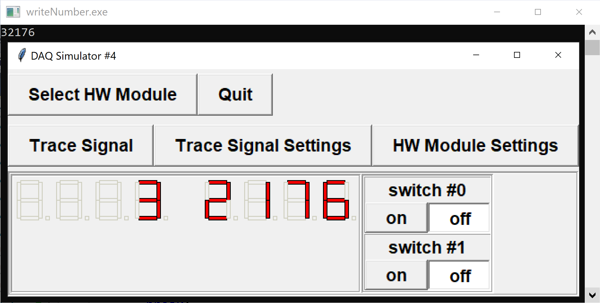
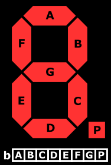

In this task, you are asked to write a program that reads a positive integer from standard input, and displays it on a set of seven-segment displays.



The DAQ module with configuration `4` has two toggle-switches and 8 seven-segment displays:

- `SWITCH0` - digital input channel 0
- `SWITCH1` - digital input channel 1
- `DISPLAY0` - display output position 0
- ...
- `DISPLAY7` - display output position 7

The seven-segment displays are arranged in reverse order, so that `DISPLAY0` is the furthest to the right.  Each seven-segment display is driven by an integer which lights up particular segments according to:



A main program is provided for you that reads an integer in the range [0, 99999999] from standard input, and calls a new function

- `void writeNumber(int val)`: writes a number to the seven-segment displays
 
It is your job to implement this new function.  You are provided with the following:

- `void displayWrite(int val, int position)`: writes a binary-encoded value to the given display position to turn on/off the corresponding LED segments

## Input Format

**NOTE:** reading from standard input is handled for you by the `DAQlib` library and the code provided.

If using the command-line simulator, each iteration of the super loop corresponds to two lines in the input.  The first line contains the values of the two digital input switches, which are to be ignored.  The second is the number to be written to the displays.

## Ouput Format

**NOTE:** the output is handled for you by the provided `DAQlib` library.

In the command-line simulator, 
- the first line indicates the setup number used to initialize the DAQ
- each subsequent group of 4 lines depicts the values of the seven-segment displays
at the end of the corresponding super loop iteration

---

## Sample

### Input
```
0 0
0
0 0
13
0 0
12345
0 0
88888888
```

### Output

```
4
                                
                                 
                                 
 ___ ___ ___ ___ ___ ___ ___ ___ 

                              _  
                             | | 
                             |_| 
 ___ ___ ___ ___ ___ ___ ___ ___ 
                              _  
                           |  _| 
                           |  _| 
 ___ ___ ___ ___ ___ ___ ___ ___ 
                  _   _       _  
               |  _|  _| |_| |_  
               | |_   _|   |  _| 
 ___ ___ ___ ___ ___ ___ ___ ___ 
  _   _   _   _   _   _   _   _  
 |_| |_| |_| |_| |_| |_| |_| |_| 
 |_| |_| |_| |_| |_| |_| |_| |_| 
 ___ ___ ___ ___ ___ ___ ___ ___ 
```

### Explanation

- The DAQ is initialized with setup number 4, and the displays are all initially blank `___` on the first call to `continueSuperLoop()`
- The first line of input (and every second line thereafter) corresponds to the values of the input switches, which are ignored
- The second input line `0` tells us to display the digit 0
- The fourth input line `13` tells us to display the number 13
- etc...